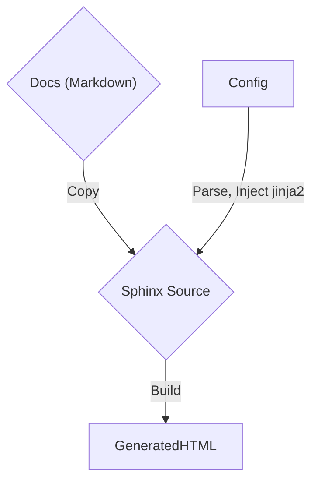

# Documentation Generation

## Summary

The documentation generator takes a configuration file (`site.yaml`) as input and produces an HTML documentation site as output. It does this by reading the configuration file and replacing relevant fields in Sphinx configuration files. The generator copies these templates into a directory along with any files or folders in the directory and runs `make html` to generate the fully-rendered HTML static site.

## Motivation

We need a common documentation site generator for all of the PageKey projects that is easy to use and update.

### Goals

- Define how the docgen works.

### Non-Goals

Out of scope:

- Anything else

## Proposal

Create a CLI. When you invoke the CLI, pass a directory. Every file in that directory is copied into an intermediate `build/sphinx` directory. The `site.yaml` file is parsed. Sphinx site templates are filled in using `jinja2`. Then, the site is generated using a system call to `make html`.

## Design and implementation details

You write code. It works.

## Alternative Solutions

Cry.
